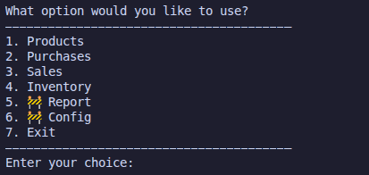

# Inventory Manager (Inv_Man 👓)

A command-line inventory management system built with **Python** and **SQLite**.

This project was created to practice software development fundamentals through a more realistic application structure.  
The system allows the user to register products, record purchases and sales, and manage stock quantities using a local database.

## Current Features

- Register new products
- View inventory
- Record purchases
- Record sales
- Automatically update stock quantities
- Store data locally with SQLite

## Project Goal

The goal of this project is to build a functional inventory control system while improving skills in:

- Python
- SQLite / SQL
- Project structure and code organization
- CLI application development
- Git and GitHub workflow

## Technologies Used

- Python
- SQLite
- Git
- GitHub

## Project Structure

```bash
invman/
├── assets/      # Images used in the README
├── src/
│   ├── cli/        # Menu and terminal interaction
│   ├── database/   # SQLite connection and query functions
│   ├── models/     # System entity classes
│   ├── services/   # Business logic and application flows
│   └── utils/      # Formatting and validation helpers
├── README.md
├── CHANGELOG.md
├── requirements.txt
└── .gitignore
```

## Terminal Preview



## How to Run

Clone this repository:

```bash
git clone https://github.com/luismanfredi/invman.git
```

Enter the project folder:

```bash
cd Inventory_Manager
```

(Optional) Create and activate a virtual environment:

```bash
python -m venv .venv
source .venv/bin/activate
```

Run the application:

```bash
python main.py
```

> If your entry file has a different name, replace `main.py` with the correct file.